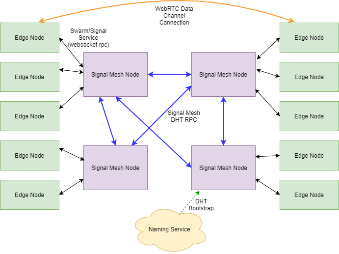
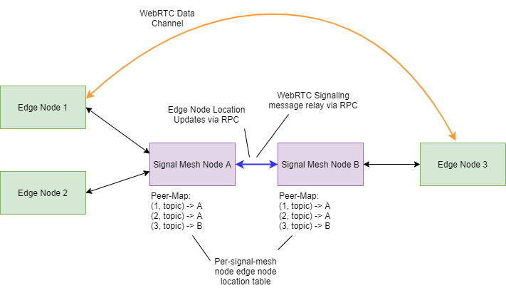

# Signal Mesh
The Signal Mesh system 
allows any pair of edge nodes to open peer-to-peer connections with each other even if both nodes
are web browsers using an internet connection with NAT. The system has no centralized control or coordination.

In order to allow web browser clients with NAT, peer-to-peer connections are made with WebRTC. 
WebRTC is built in to all modern web browsers and includes support for NAT traversal. However 
in order for it to function, two additional services are required:

1. Swarm Discovery: 
1. WebRTC Signaling:

In traditional centralized systems, discovery and signaling are services run by the product provider such as Google, Slack, etc. By contrast the Signal Mesh system provides these same services in a decentralized manner.

# System operation
Signal Mesh nodes form a [DHT](https://en.wikipedia.org/wiki/Distributed_hash_table). Nodes communicate with a multicast-capable [RPC](https://en.wikipedia.org/wiki/Remote_procedure_call) protocol over the DHT's peer connections. The RPC protocol provides the following functionality:

1. Propagate edge node location records to all nodes.
1. Relay WebRTC offer and answer messages between nodes.
1. Propagate management data (e.g. to allow a management view of the entire system).

DHT bootstrap nodes are discovered from WNS
DHT forms over “signal mesh” topic which is per-devnet and per-signal-protocol-version, seeded from a string.
DHT provides open sockets (TCP/UDP?) to upper layer over the signal mesh topic
Next layer runs Hypercore v8 over that socket
Next layer is moleculer nodeId is the local transport session public key from Hypercore.
Each signal/swarm node accepts connections from edge nodes via websockets transport.
Each edge node has a unique ID (called Peer ID).
Edge-nodes advertise topics. A topic is a unique ID (different from Peer ID).
The signal/sawarm node maintains a table of the currently connected edge nodes and the topics they advertise.
An edge node may submit a “discover” request for a given topic.
Signal/swarm node responds with a set of zero or more (what’s the max?) peers that have advertised the requested topic.
Upon receipt of the set of peers advertising the requested topic, the edge node selects one or more of them
and attempts to make connections to them.

Connections between edge nodes are made via WebRTC. Offer/Answer

There is a topic for the mesh nodes.

The signal mesh DHT connections are UDP hole punching-capable (how?)

## Peer-to-peer Connection Establishment

Walk through all the steps required to establish a p2p connection.

## Block Diagram

The Signal Mesh system uses the following packages:
* [socket-signal](https://github.com/geut/socket-signal)
* [nanomessage-rpc](https://github.com/geut/nanomessage-rpc)
* [nanomessage](https://github.com/geut/nanomessage)
* [simple-peer](https://github.com/feross/simple-peer)
* [simple-websocket](https://github.com/feross/simple-websocket)
* [moleculer](https://github.com/moleculerjs/moleculer)
* [hyperswarm](https://github.com/hyperswarm/hyperswarm)
* [@hyperswarm/dht](https://github.com/hyperswarm/dht)
* [simple-hypercore-protocol](https://github.com/mafintosh/simple-hypercore-protocol)
* [@dxos/broadcast](https://github.com/dxos/broadcast)
* [@dxos/protocol](https://github.com/dxos/protocol)

[WebSocket](https://en.wikipedia.org/wiki/WebSocket)
