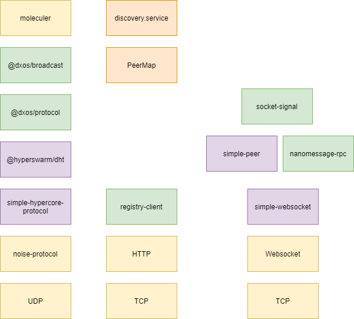

# Signal Mesh
The Signal Mesh system 
allows any pair of edge nodes to open peer-to-peer connections between each other, including the case that both nodes
are web browsers using an internet connection with NAT. The system has no centralized control or coordination.

In order to allow web browser clients with NAT, peer-to-peer connections are made with WebRTC. 
WebRTC is built-in to all modern web browsers and includes support for NAT traversal. However 
in order for it to function, two additional services are required:

1. Swarm Discovery: the mechanism by which nodes that wish to establish connections identify and locate each other.
1. WebRTC Signaling: the mechanism by which WebRTC [JSEP](https://rtcweb-wg.github.io/jsep/) control messages are relayed between prospective peers.

In traditional centralized systems, discovery and signaling are services deployed and run by the product provider such as Google, Slack, etc. By contrast the Signal Mesh system provides these same services in a decentralized manner.

# System Overview
Signal Mesh comprises a set of nodes that form a [DHT](https://en.wikipedia.org/wiki/Distributed_hash_table) implemented with [@hyperswarm/dht](https://github.com/hyperswarm/dht) over a single swarm topic that is chosen at network genesis and hashed with the current mesh protocol version. This allows concurrent operation of several different protocol versions as well as operation of multiple testnets if required. 
Nodes bootstrap their DHT from records found in the [DXOS Naming Service](https://github.com/wirelineio/dxns/).

DHT peer connections between nodes use the [Dat Hypercore Wire Protocol, v8](https://github.com/mafintosh/simple-hypercore-protocol) and [Noise Protocol](http://www.noiseprotocol.org/) transport layer security. A multicast-capable [RPC](https://en.wikipedia.org/wiki/Remote_procedure_call) protocol operates on these secure peer connections, implemented with [DXOS Broadcast Protocol](https://github.com/dxos/broadcast) and [moleculer](https://github.com/moleculerjs/moleculer). The RPC protocol provides the following functionality:

1. Propagate edge node location records to all nodes.
1. Relay WebRTC offer and answer messages between nodes.
1. Propagate management data (e.g. to allow a management view of the entire system).

Discovery and WebRTC signaling service is provided to edge nodes via a [WebSocket](https://en.wikipedia.org/wiki/WebSocket)-based RPC protocol.
  

## System Operation

First consider the case where there is only one Signal Mesh node:
* Edge nodes are assigned a random unique ID (Peer ID) and connect to the Signal node.
* Edge nodes connect to the Signal node with a long-lived Websocket RPC connection.
* Edge nodes advertise one or more application-selected swarm topics by sending those topics to the Signal node.
* The Signal node maintains a table of the recently connected edge node Peer IDs along with the swarm topics they have advertised.
* An "initiating" Edge node may submit a “discover” request for a given topic.
* The Signal node responds a set of the IDs of zero or more peers that have advertised the requested topic.
* Upon receipt of the set of peers advertising the requested topic, the edge node selects one or more of them
as candidate peers.
* The initiating edge node generates a WebRTC JSEP Offer message targeting one of the candidate peers and sends that message to the Signal node.
* The Signal node forwards the Offer message to the target Edge node via its open RPC connection.
* The target Edge node delivers the Offer message to WebRTC which in turn generates an Answer message.
* The answer message is sent back to the Signal node which forwards it to the initiating Edge node.
* The initiating Edge node delivers the Answer message to WebRTC which proceeds to establish a session with the target node.

Note that there may be multiple "trickled" Offer and Answer messages and that the initiating Edge node may attempt to connect to more than one candidate peer for the same topic.

We can now extend this scheme to incorporate the Signal Mesh DHT as follows:
* Each Signal Mesh node in the DHT is assigned a unique ID.
* Each Edge node connects to a "home" Signal Mesh node.
* When swarm topic advertisements are received from Edge nodes, the home Signal Mesh node multicasts that information across the entire DHT.
* The multicast advertisement records allow each Signal Mesh node to maintain an aggregate table mapping Edge node Peer IDs and their advertised swarm topics to their current home Signal Mesh node.
* An "initiating" Edge node may submit a “discover” request for a given topic.
* The Signal node responds a set of the IDs of zero or more peers that have advertised the requested topic.
* The initiating edge node generates a WebRTC JSEP Offer message targeting one of the candidate peers and sends that message to the Signal node.
* If the target Edge node is "local" (its home node is this node), forward the Offer message to the target Edge node via its open RPC connection, otherwise relay the Offer message via DHT RPC to the appropriate home server.
* If relayed, the target's home Signal Mesh node forwards the Offer message to the target Edge node via its open RPC connection.
* Similarly, non-local Answer messages are relayed back over the DHT RPC network and onward to the initating Edge node.
* Once initating and target Edge nodes have exchanged Offer and Answer messages, potentially relayed through the Signaml mesh DHT, WebRTC session establishment proceeds.

## Signal Mesh Node Architecture

The diagram below shows the relationsip between the Signal Mesh node's major components:

### Dependencies
* [socket-signal](https://github.com/geut/socket-signal)
* [nanomessage-rpc](https://github.com/geut/nanomessage-rpc)
* [nanomessage](https://github.com/geut/nanomessage)
* [discovery-swarm-webrtc](https://github.com/geut/discovery-swarm-webrtc)
* [simple-peer](https://github.com/feross/simple-peer)
* [simple-websocket](https://github.com/feross/simple-websocket)
* [moleculer](https://github.com/moleculerjs/moleculer)
* [hyperswarm](https://github.com/hyperswarm/hyperswarm)
* [@hyperswarm/dht](https://github.com/hyperswarm/dht)
* [simple-hypercore-protocol](https://github.com/mafintosh/simple-hypercore-protocol)
* [@dxos/broadcast](https://github.com/dxos/broadcast)
* [@dxos/protocol](https://github.com/dxos/protocol)
* [noise-protocol](https://github.com/emilbayes/noise-protocol)
